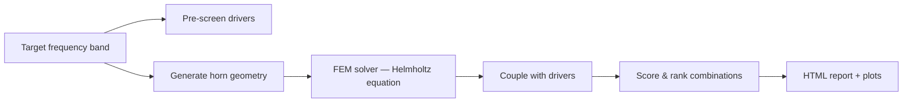
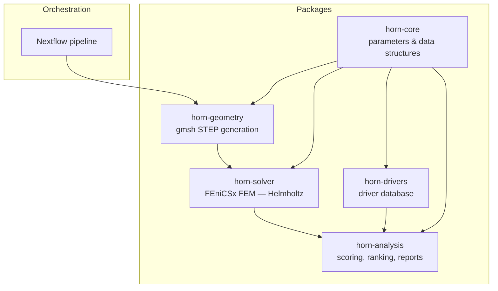
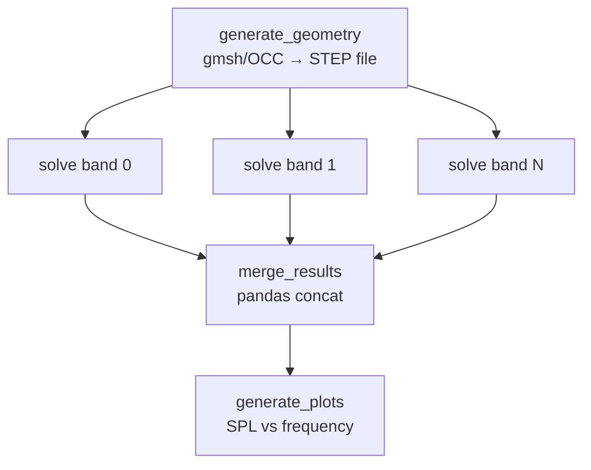

# Horn Loudspeaker Simulation Pipeline

> Design and simulate horn-loaded loudspeakers — from a target frequency band to ranked driver-horn recommendations — using FEM acoustics, a driver database, and automated optimization.

[](https://github.com/timini/horn-simulation/actions/workflows/ci.yml)


## What is this?

An open-source tool for acoustic horn design. Give it a target frequency band and it will generate horn geometries, solve the Helmholtz equation with FEM, couple the results with real loudspeaker drivers via Thiele-Small parameters, and rank every driver-horn combination — producing a self-contained HTML report you can open in any browser.

Built for audio engineers, acousticians, DIY speaker builders, and researchers.

## Key features

- **3 horn profiles** — conical, exponential, hyperbolic
- **FEM Helmholtz solver** — FEniCSx/dolfinx with adaptive meshing and radiation BC
- **Driver database** with Thiele-Small parameter coupling
- **3 operating modes** — single simulation, auto comparison, full-auto design exploration
- **Self-contained HTML reports** — rankings, plots, and driver tables, all base64-embedded
- **Containerized and parallelized** — Docker + Nextflow, frequency bands solved in parallel

## How it works

### Pipeline flow



### Package architecture



### Frequency parallelization



## Operating modes

### Single mode (default)

Simulate one horn with explicit geometry parameters and get a frequency response plot.

```bash
nextflow run main.nf -profile docker \
    --throat_radius 0.05 --mouth_radius 0.2 --length 0.5
```

### Auto mode

Fix the geometry, simulate all 3 profiles (conical, exponential, hyperbolic), couple every pre-screened driver, and rank the combinations. Only 3 FEM simulations — driver coupling is pure Python via the transfer function.

```bash
nextflow run main.nf -profile docker --mode auto \
    --target_f_low 500 --target_f_high 4000 \
    --mouth_radius 0.2 --length 0.5 --top_n 10
```

### Fullauto mode

Specify **only** a target frequency band. The system derives horn geometry analytically (mouth radius from cutoff frequency, length from quarter-wave to half-wave), generates a grid of 3 profiles x N mouth radii x N lengths, runs FEM on all candidates, couples with pre-screened drivers, and ranks everything.

```bash
nextflow run main.nf -profile docker --mode fullauto \
    --target_f_low 500 --target_f_high 4000
```

## Quick start

### Prerequisites

- [Docker](https://www.docker.com/get-started)
- [just](https://github.com/casey/just) (task runner)
- [Nextflow](https://www.nextflow.io/docs/latest/getstarted.html#installation)
- **Java 11–22** (required by Nextflow; Java 25+ is not supported). On macOS: `brew install openjdk@21`

### Build

```bash
just build
```

### Run

```bash
nextflow run main.nf -profile docker --mode fullauto \
    --target_f_low 500 --target_f_high 4000
```

Open the report:

```bash
open results/fullauto/report/auto_report.html
```

### Test

```bash
just test                        # all packages
just test-package horn-solver    # single package
```

## Parameters

<details>
<summary><strong>Single mode (default)</strong></summary>

| Parameter | Description | Default |
|-----------|-------------|---------|
| `throat_radius` | Horn throat radius (m) | `0.05` |
| `mouth_radius` | Horn mouth radius (m) | `0.2` |
| `length` | Horn length along Z-axis (m) | `0.5` |
| `profile` | Horn flare profile | `conical` |
| `min_freq` | Minimum simulation frequency (Hz) | `500` |
| `max_freq` | Maximum simulation frequency (Hz) | `8000` |
| `num_intervals` | Number of frequency steps | `100` |
| `mesh_size` | Target mesh element size (m) | `0.01` |
| `num_bands` | Parallel frequency band jobs | `8` |
| `outdir` | Output directory | `./results` |

</details>

<details>
<summary><strong>Auto mode (<code>--mode auto</code>)</strong></summary>

| Parameter | Description | Default |
|-----------|-------------|---------|
| `target_f_low` | Target low frequency (Hz) | `500` |
| `target_f_high` | Target high frequency (Hz) | `4000` |
| `drivers_db` | Path to driver database JSON | `data/drivers.json` |
| `top_n` | Number of top results to return | `10` |

</details>

<details>
<summary><strong>Fullauto mode (<code>--mode fullauto</code>)</strong></summary>

| Parameter | Description | Default |
|-----------|-------------|---------|
| `target_f_low` | Target low frequency (Hz) | `500` |
| `target_f_high` | Target high frequency (Hz) | `4000` |
| `drivers_db` | Path to driver database JSON | `data/drivers.json` |
| `top_n` | Number of top results to return | `10` |
| `num_mouth_radii` | Mouth radius grid points | `3` |
| `num_lengths` | Length grid points | `3` |
| `num_intervals` | Frequency steps per simulation | `100` |
| `num_bands` | Parallel frequency band jobs | `8` |

</details>

## Packages

| Package | Purpose | Key Dependencies |
|---------|---------|-----------------|
| `horn-core` | Shared data structures (`HornParameters`, `DriverParameters`) | numpy |
| `horn-geometry` | Procedural horn geometry generation (STEP files) | gmsh (OpenCASCADE) |
| `horn-solver` | FEM acoustic solving + meshing | FEniCSx/dolfinx, gmsh |
| `horn-analysis` | Result merging, plotting, scoring, ranking, HTML reports | pandas, matplotlib, scipy |
| `horn-drivers` | Driver database loading and validation | numpy, horn-core |

## Acoustic modelling

### Governing equation

The solver computes the steady-state acoustic pressure field inside the horn by solving the **time-harmonic Helmholtz equation**:

```
∇²p + k²p = 0
```

where `p` is complex acoustic pressure, `k = 2πf / c₀` is the wave number, `f` is frequency, and `c₀ = 343 m/s` is the speed of sound in air.

This is discretised using the **Finite Element Method (FEM)** via FEniCSx/dolfinx. The weak (variational) form used is:

```
∫_Ω [∇p · ∇q − k²pq] dx − jk ∫_outlet pq ds = 0
```

where `q` is a test function from a first-order Lagrange (P1) finite element space on the tetrahedral volume mesh. The surface integral implements the first-order Sommerfeld radiation condition at the outlet. The linear system is solved with a direct LU factorisation via PETSc at each frequency.

### Boundary conditions

The horn mesh has three tagged boundary regions, identified automatically by the z-coordinate of each surface's centre of mass:

| Boundary | Tag | Location | Condition |
|----------|-----|----------|-----------|
| **Inlet** (throat) | 2 | z = 0 | Dirichlet: p = 1 Pa (unit driving pressure) |
| **Outlet** (mouth) | 3 | z = length | Robin: ∂p/∂n = −jkp (radiation impedance) |
| **Walls** | 4 | Remaining surfaces | Neumann: ∂p/∂n = 0 (sound-hard walls) |

The wall Neumann condition is natural (satisfied implicitly by the variational form). The inlet Dirichlet condition models a piston driver producing a uniform pressure at the throat. The outlet Robin condition (first-order Sommerfeld radiation condition) is implemented as `a -= jk ∫_outlet p·q ds`, which adds radiation damping and is accurate for ka < ~3.

### Meshing and adaptive element sizing

The STEP geometry is imported into gmsh's OpenCASCADE kernel, which generates a 3D tetrahedral mesh with uniform element size. To ensure accurate wave resolution, the solver enforces a **λ/6 rule**: the element size must not exceed one-sixth of the shortest wavelength being simulated:

```
h_adaptive = c₀ / (6 × f_max)
```

The actual mesh size used is the finer of the user-specified `mesh_size` and `h_adaptive`. Since each frequency band has its own `f_max`, lower bands automatically get coarser (faster) meshes while higher bands get finer meshes.

For example, at `f_max = 8000 Hz`: λ_min = 43 mm, so h_adaptive = 7.1 mm.

### SPL calculation

Sound Pressure Level is computed from the RMS pressure integrated over the **outlet surface** (horn mouth), giving a physically meaningful metric independent of mesh refinement or horn volume:

```
p_rms = √( ∫_outlet |p|² ds  /  A_outlet )

SPL = 20 × log₁₀(p_rms / p_ref)
```

where `p_ref = 20 µPa` is the standard acoustic reference pressure. The outlet area `A_outlet` is computed once before the frequency loop since the mesh is static.

### Frequency sweep

Frequencies are logarithmically spaced using `np.geomspace`, providing finer resolution at lower frequencies where acoustic behaviour changes more rapidly. The total range is split into `num_bands` independent sub-ranges that run in parallel as separate Nextflow processes, each in its own Docker container. Results are merged and sorted by frequency after all bands complete.

### Physical constants

| Constant | Value | Description |
|----------|-------|-------------|
| c₀ | 343.0 m/s | Speed of sound in air (~20 °C) |
| ρ₀ | 1.225 kg/m³ | Air density at sea level |
| p_ref | 20 µPa | SPL reference pressure |

### Limitations

- **First-order radiation BC**: The outlet uses a first-order Sommerfeld (Robin) condition, which is accurate for ka < ~3 but increasingly reflective at higher frequencies/larger apertures.
- **Sound-hard walls**: No absorption or damping. Walls are perfectly rigid.
- **Constant air properties**: Temperature and humidity dependence not modelled.
- **Three profiles**: Supports conical, exponential, and hyperbolic. Tractrix profile is not yet available.

## Architecture

This is a monorepo with each package in `packages/`. Each package has its own Dockerfile with multi-stage builds (base → production → test). Tests run inside Docker containers to ensure reproducibility.

The pipeline is orchestrated by Nextflow (`main.nf`), which maps each process to its corresponding Docker container via `nextflow.config`.

## Roadmap

Prioritised capabilities for reaching feature parity with tools like AKABAK. See linked GitHub issues for details.

### Priority 1 — Near-term

- Interior field visualisation (VTK/ParaView export from dolfinx) — [#45](https://github.com/timini/horn-simulation/issues/45)
- Arbitrary STEP file import workflow (user-supplied geometry) — [#47](https://github.com/timini/horn-simulation/issues/47)

### Priority 2 — Medium-term

- Exterior radiation / directivity (Kirchhoff-Helmholtz integral post-processing) — [#48](https://github.com/timini/horn-simulation/issues/48)
- Flexible boundary tagging (replace z-coordinate heuristic with surface naming) — [#49](https://github.com/timini/horn-simulation/issues/49)

### Priority 3 — Longer-term

- Complex geometry support (folded horns, phase plugs, back-loaded horns) — [#51](https://github.com/timini/horn-simulation/issues/51)
- Tractrix horn profile
- Wall absorption / damping materials
- Second-order radiation BC for large ka

### Completed

- Fullauto mode: derive horn geometry grid from a target frequency band
- HTML report for auto-mode: single self-contained `auto_report.html` with rankings table, 4 embedded plots (coupled SPL, raw profile SPL, impedance, phase/group delay), driver T-S parameter table, and summary cards
- Driver coupling with T-S parameters (transfer function + auto-select pipeline) — [#50](https://github.com/timini/horn-simulation/issues/50)
- Analysis features: impedance plots, scoring, driver DB — [#35](https://github.com/timini/horn-simulation/issues/35)
- Profile diversity: conical, exponential, hyperbolic

## Contributing

Contributions welcome. Please open an issue first to discuss what you'd like to change.

## License

See repository for license details.
