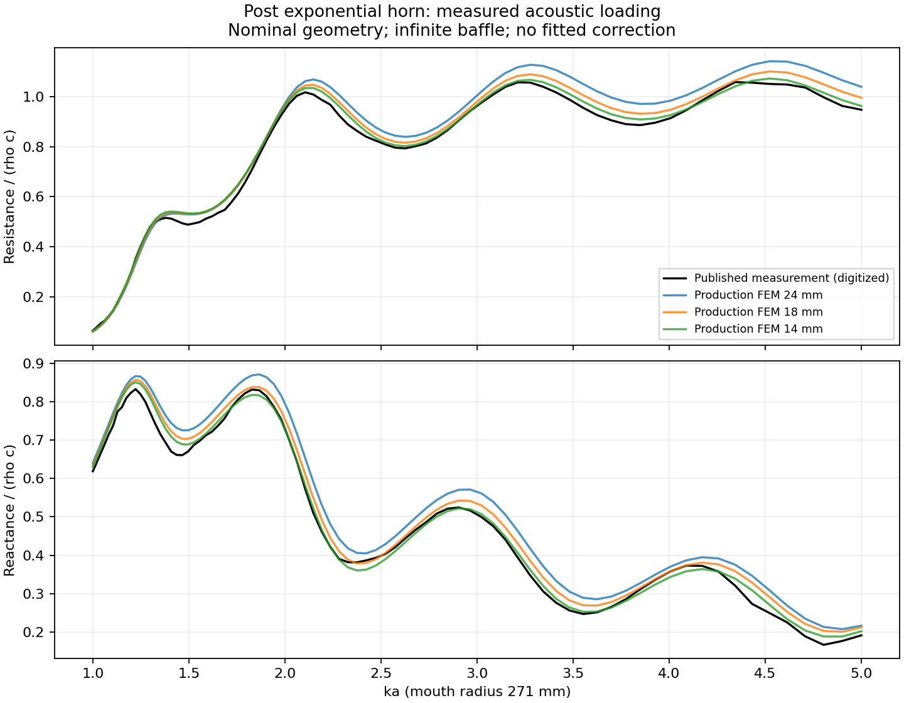

# Measured exponential-horn acoustic loading

This is a bounded comparison of the production horn solver with measured acoustic input impedance. It does not qualify a complete horn-and-driver assembly, electrical-drive sensitivity, fabrication drawings or recommendation ordering.

## Reference and scope

John Post's 1994 [*A Modeling and Measurement Study of Acoustic Horns*](https://audioroundtable.com/misc/post_hixson_horns.pdf), chapter 4, describes fiberglass exponential and tractrix horns mounted in an effectively infinite floor baffle. Figures 4.26 and 4.27 (printed pages 108–109, PDF pages 120–121) show measured resistance and reactance using the two-microphone technique. The blue lines are measurements; the circular markers are the author's numerical model and are not used as measured data.

The exponential horn's nominal throat radius is 25.4 mm, mouth radius 271 mm and axial length 559 mm. The measured throat area was 2.5% larger than nominal; the paper has already applied its 1.025 normalization correction to the plotted measurements. We do not apply that correction again or fit any level, phase, frequency or geometry shift. Mouth dimensions were within 2 mm. The full as-built interior contour is unavailable, so comparison with nominal CAD includes construction uncertainty.

The tractrix prototype is excluded from this matched comparison: the author found its contour length 2% greater than designed and could not reconstruct its actual shape. It is not a held-out physical assembly for validating selection order.

## Frozen comparison

The script extracts the blue vector coordinates from the source PDF, with chart axes checked against the rendered pages. These are **digitized published traces**, not the original 1,601 analyzer samples. The approximately 0.005 normalized-impedance line thickness indicates digitization resolution; it is not a complete measurement uncertainty estimate. Numeric observations and source identity are archived; the copyrighted thesis and figure artwork are not redistributed.

The declared range is `1 ≤ ka ≤ 5`, where `a` is mouth radius. It lies above the paper's sub-100 Hz calibration concerns and below its documented wall resonances at `ka > 6`. Comparison uses dimensionless frequency and impedance to avoid assigning an unreported measurement temperature. At the simulation's 343 m/s this corresponds to approximately 201–1,007 Hz.

The existing production STEP entry point validates circular ports and axisymmetry, then uses a prescribed uniform inlet velocity, lossless P1 FEM and the optional 16-mode baffled mouth. It generates the nominal exponential contour with 40 loft sections and separately solves meshes of 24, 18 and 14 mm, each at 81 logarithmically spaced frequencies. Solver results use `Z_acoustic S_throat / (rho c)`, matching the published normalization.

Limits were committed before numerical execution:

- Finest-mesh comparison: 95th-percentile magnitude error at most 2 dB, 95th-percentile phase error at most 10 degrees, maximum complex normalized-impedance difference at most 0.25.
- Both consecutive mesh comparisons: maximum magnitude change at most 0.5 dB and phase change at most 5 degrees.
- Numerical residual at most 1e-8 and relative acoustic power imbalance at most 1e-7; finite, passive impedance and complete frequency coverage.

These are engineering comparison limits for this component, not the absolute-SPL acceptance limits in #81. The nominal geometry and missing formal uncertainty budget limit the interpretation even if all comparisons pass. This study does not establish convergence for every profile, mouth-mode count, frequency grid or loft count; the separate numerical studies document those checks in their own domains.

## Executed result

**Both the measured comparison and mesh-refinement gates pass.** The frozen source is `b8b2b01` and the pinned solver image/runtime is recorded in the [identity manifest](../data/validation/post_hixson_manifest.json) and archive. All three sweeps completed normally: 243 frequency solves in total.

| Comparison | Magnitude difference | Phase difference |
| --- | --- | --- |
| Finest mesh vs measurement, 95th percentile | 0.417 dB | 1.795 degrees |
| Finest mesh vs measurement, maximum | 0.497 dB | 1.873 degrees |
| Mesh 24 → 18 mm, maximum | 0.392 dB | 1.315 degrees |
| Mesh 18 → 14 mm, maximum | 0.300 dB | 0.929 degrees |

Maximum complex normalized-impedance error is 0.051 against the frozen 0.25 limit. Maximum solver residual is 2.02e-12 and power imbalance 5.28e-14. Phase error does not decrease monotonically with refinement; the finest result still meets its limit. Nominal geometry and digitization uncertainty remain part of the interpretation.



The [raw evidence archive](../data/validation/post_hixson_artifacts.tar.gz) contains the digitized observations, three CAD/solver sweeps, runtime records, execution logs, frozen protocol, source snapshot and input/output identities. The [machine-readable result](../data/validation/post_hixson_reference.json) explicitly retains `physical_assembly_qualified: false`. CI independently reconstructs the measurement error statistics from those observations and solver outputs.

This provides direct measured support for the horn-loading model in this bounded case. The remaining #81 dependency is a characterized real driver/interface and a calibrated complete-assembly comparison, including a second configuration for ranking.

## Reproduction

Use the source revision and immutable solver image in the archived protocol. Prerequisites are the project's normal Python dependencies, Docker and Poppler's `pdftocairo`. Obtain the public source PDF from the link above, then run:

```sh
python scripts/validate_post_hixson.py prepare --pdf /path/to/post_hixson_horns.pdf \
  --out results/post-hixson --image sha256:<installed-solver-image-id>
python scripts/validate_post_hixson.py solve --out results/post-hixson
python scripts/validate_post_hixson.py compare --out results/post-hixson
```

Preparation requires a clean committed checkout. Execution records the actual worker runtime and retains raw solver CSVs, CAD, logs and input/output hashes. Comparison checks the saved identities and retains failures. The prior launcher attempts v1/v2 stopped before any frequency solve (architecture selection and use of the lower-level mesh API); they are not passing numerical evidence.
