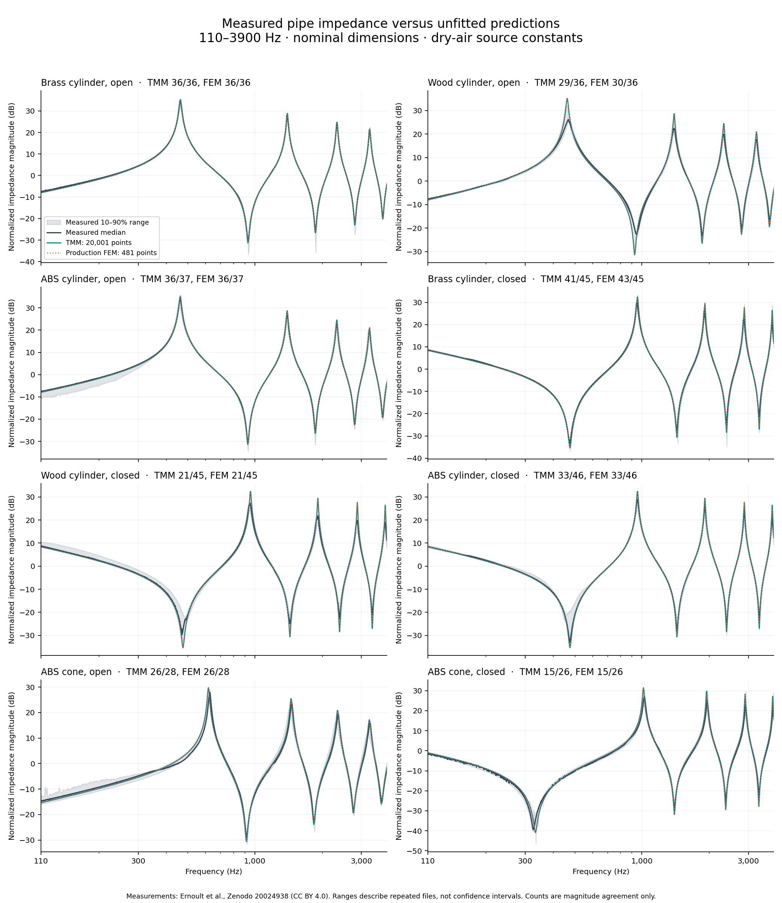

# Reference validation report — 8 September 2026

The fresh audit supports the numerical solver and the finite-grid search, but the physical model passes only part of the measured reference set. **Full horn-and-driver validation remains incomplete.** No physics parameters or measurement tolerances were tuned to improve these results.

## Results

| Check | Result | What it establishes |
| --- | --- | --- |
| Reference import | Six archives; 383 curves, 378 unique files; prior exports reproduced byte for byte | Reproducible source acquisition and import, not model accuracy |
| Measured impedance, dense TMM | **237/299** within magnitude limits | Partial agreement for nominal rigid-wall pipes |
| Measured impedance, production FEM | **240/299** on 481 frequencies | Sampled magnitude agreement; not a continuous-band pass |
| Independent simulations | **40/40** match at supplied frequencies | Numerical agreement within the project magnitude limits; two references have only 3 and 11 in-band points |
| Solver health | **15/15** runs pass | Residual, solver convergence, passivity, dissipation and energy balance |
| Mesh convergence | **5/5** geometries pass | Largest 4 mm → 3 mm impedance change: **0.0174 dB**, at 121 common frequencies |
| Exhaustive search audit | **4/4** bands pass | All feasible top-ten results and winners retained; zero score regret |
| Published conical-horn scalar | Measured **1712 Hz**, predicted **1712.6 Hz** | One resonance-frequency check, with unverified air/lip conditions |
| Focused safeguards/import/comparison tests | **65 passed** | Invalid evidence is rejected; phase and magnitude remain distinct |

The full pipe audit took **9 minutes 10 seconds**, including 3,615 production FEM frequency solves, dense analytical predictions, comparisons and convergence checks. The separate search benchmark took **6 minutes 29 seconds**. The machine-readable summary is [reference_audit_2026_09_08.json](../data/validation/reference_audit_2026_09_08.json).

## Measured data and limits

The source is [Ernoult et al., Zenodo record 20024938, v2](https://zenodo.org/records/20024938), CC BY 4.0. The 299 curves contain repeated measurements and multiple specimens from five experimenters; they are not 299 independent assemblies. Eight material/termination cases map to five distinct nominal rigid-wall air-domain models. The solver does not represent differences in material compliance, porosity or roughness.

All comparisons use 110–3900 Hz, source air properties and nominal dimensions. The authors already corrected measurements to dry air at 25°C. Magnitude criteria remain median absolute error ≤2 dB and 95th-percentile error ≤4 dB. Phase errors are reported without a phase acceptance gate. These project tolerances are different from the source paper's uncertainty-based statistical test.

| Case | Curves | Dense TMM matches | FEM sampled matches | Typical dense p95 error | Typical FEM p95 phase error |
| --- | ---: | ---: | ---: | ---: | ---: |
| Brass cylinder, open | 36 | 36 | 36 | 1.14 | 5.6° |
| Wood cylinder, open | 36 | 29 | 30 | 3.41 | 21.4° |
| ABS cylinder, open | 37 | 36 | 36 | 1.63 | 6.8° |
| Brass cylinder, closed | 45 | 41 | 43 | 2.45 | 12.8° |
| Wood cylinder, closed | 45 | 21 | 21 | 4.08 | 36.6° |
| ABS cylinder, closed | 46 | 33 | 33 | 2.22 | 10.5° |
| ABS cone, open | 28 | 26 | 26 | 2.94 | 13.3° |
| ABS cone, closed | 26 | 15 | 15 | 3.52 | 18.4° |

“Typical p95” is the median of the per-curve 95th-percentile errors. Every failure remains in the raw audit. Historical held-out curves retain their labels (201/263 dense magnitude matches), but those data were already examined before this rerun; they are not newly unseen validation data.



Gray ranges show the 10th–90th percentiles across measured files, not confidence intervals. Attribution: Ernoult et al., Zenodo 20024938, CC BY 4.0; plots and model predictions generated by this project.

## What the expanded checks revealed

**Frequency sampling changes apparent success.** Evaluating the same TMM and measurements on 121, 241, 481 and 961 points changes 13, 9, 5 and 3 individual classifications relative to the 20,001-point assessment. On the same 481-point grid, FEM and TMM classifications agree for all 299 measurements. The higher sampled pass count is therefore not evidence of improved model accuracy. Mesh changes were much smaller: ≤0.0174 dB at the checked frequencies; 400 → 800 TMM segments changed dense impedance by at most 0.00138 dB.

**Sparse reference points cannot be interpolated across missing resonances.** The two Operator-F 3D simulations provide only 3 and 11 points within the band. An initial diagnostic interpolated them into full curves and produced spurious 25–29 dB p95 errors. The corrected audit evaluates all 40 numerical references at their supplied frequencies. The sparse cylinder and cone comparisons have maximum errors of 0.00265 dB and 0.287 dB respectively. Across all 40 references, the largest p95 error is 0.558 dB and the largest point error is 3.226 dB. The earlier invalid interpolation diagnostic is preserved locally; it is not a physical-model failure or a full-band reference pass.

**Wood and closed ends remain weak cases.** The [benchmark authors, section 5.3](https://doi.org/10.1051/aacus/2026048) also find larger discrepancies for these conditions and discuss roughness, porosity and capping procedures. This context does not establish the cause of each failure in our results. Resolving these differences requires explicit uncertainty and boundary/material models rather than looser tolerances.

**A separate published horn check is encouraging but narrow.** [Sa and Park (2014), section 2.2 / Fig. 13](https://doi.org/10.5050/KSNVE.2014.24.7.537) explicitly report a sixth impedance resonance at 1712 Hz for a 535 mm cone, 18 mm throat and 80 mm mouth. Both 400- and 800-segment predictions give 1712.6 Hz. This uses assumed air properties and an unflanged lip; experimental peak-estimation uncertainty is not supplied. It does not validate amplitude, the loudspeaker motor or far-field SPL. The source's separate short-horn mouth is 90 mm in body text/Figs. 14/17 but 80 mm in Fig. 18, so the catalog preserves that ambiguity.

## Search and complete-assembly coverage

The fresh search audit exhaustively evaluates 20 conical/exponential geometries with three manufacturer-parameter drivers in four bands. It retains every feasible top-ten result and the winner, with zero score regret. Feasible pair counts are 32, 40, 38 and 28. This is a finite numerical benchmark, not proof of physical driver ranking or a global optimum.

The verified inventory also includes 44 DIY FRD/ZMA curves from five Waslo archives. Their geometry, motor/interface, filtering or calibrated observation conditions are not sufficiently matched to a supported assembly to count as full physical validation. [Rasetshwane and Neely (2015)](https://pmc.ncbi.nlm.nih.gov/articles/PMC4617734/) uses sealed caps and fitted source/cap corrections; its published measurements cannot be treated as an open-mouth SPL reference.

The measured pipe results apply to **opt-in boundary-layer losses and matched pipe terminations**. The pipeline's default lossless configuration remains experimental and does not inherit these results. Complete driver coupling, chamber/phase-plug/rear-load effects, absolute listening-distance SPL, exterior diffraction/directivity and recommendation ordering between measured assemblies remain unvalidated. [Issue #81](https://github.com/timini/horn-simulation/issues/81) stays open.

## Evidence and reproduction

Local complete evidence is under `results/reference-validation-2026-09-08/`: `final/audit.json`, the frozen protocol/prediction hashes, all raw solver and analytical predictions, `search/search_benchmark.json`, `sa-park/comparison.json`, verified reimported archives and the standalone `report/reference-report.html`.

The final run uses the unchanged merged production physics. Its original execution hashes are retained. Review subsequently added fail-closed health and mesh guards; all 15 final CSVs and five mesh comparisons were rechecked through those guards and passed (`final/final-health-guard-recheck.json`). The final successful run shuts worker processes down gracefully and has no PETSc/MPI abort messages. Tests cover rejecting bad health, changed archives, overwritten evidence, mixed prediction manifests, missing/changed imports, mismatched frozen air constants, failed mesh convergence, stale search configurations and changed resonance evidence. The rendered report verifies the separate search and resonance protocols and their raw artifacts.

After building the solver image and importing the pinned archives, run from the repository root with a new output directory:

```sh
docker run --rm -v "$PWD:/workspace" -w /workspace \
  -e OPENBLAS_NUM_THREADS=1 -e OMP_NUM_THREADS=1 \
  -e PYTHONPATH=/usr/local/lib:/workspace/packages/horn-core/src:/workspace/packages/horn-drivers/src:/workspace/packages/horn-analysis/src:/workspace/packages/horn-geometry/src:/workspace/packages/horn-solver/src \
  horn-solver:latest python3 scripts/validate_reference_audit.py --workers 5 \
  --reference-dir results/validation-81/imported/ernoult-pipe-impedance-v2 \
  --archive results/validation-81/external/pipe-impedance-20024938.zip \
  --output-dir results/reference-reproduction
```

`--workers 1` uses less CPU. `scripts/benchmark_search.py` reproduces the search audit; `scripts/validate_published_horn_resonance.py` reproduces the single published horn datum. `scripts/render_reference_audit.py --help` lists the required frozen audit, full import inventory, search and resonance inputs for the self-contained report. It verifies their relevant provenance before drawing plots and uses the archived air constants. The separate versioned `data/validation/reference_audit_evidence.json` pins the completed audit, search, resonance, inventory and individual search-response/CAD digests independently of those inputs. A different run requires a separately reviewed digest manifest supplied with `--evidence-manifest`; do not regenerate expected hashes from potentially changed inputs just to make rendering pass. Search checks require every geometry–driver pair and enforce the shortlist budget. Archive identity is authenticated against the reference catalog, and all 339 pipe curves and source-member metadata are reproduced from that archive before comparison; resonance air, loss and radiation settings must match the stated protocol. Report dates must agree with the authenticated run timestamp.
