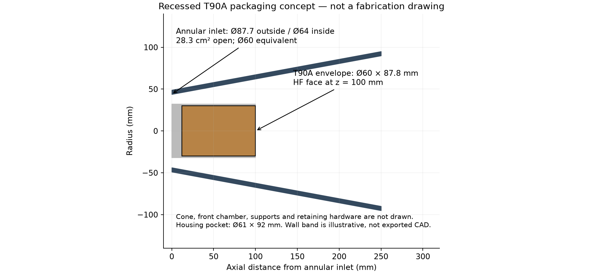
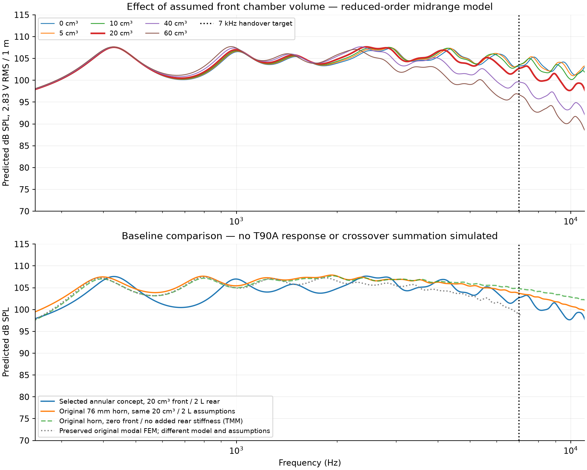

# 6NMB420 with a recessed Fostex T90A: annular-throat study

**Result: a smaller-throat packaging concept has been modelled, but a successful 7 kHz handover is not established.** The selected reduced-order case has 7.18 dB unfiltered variation over 320–7000 Hz, missing the inherited 6 dB target. It is a useful geometry for the next simulation, not a fabrication-ready phase plug or a qualified speaker design.



## Geometry that fits around the bullet

The T90A is reserved inside a **64 mm outside-diameter housing**. A circular opening smaller than the bullet is never used. “Equivalent throat diameter” refers to the **open annular area**: `S = π(D_outer² − D_housing²)/4`.

| Selected smaller-area concept | Value |
|---|---:|
| Mid driver | 18Sound 6NMB420, 8 Ω |
| Outer horn profile | Conical |
| Outer throat diameter | **87.73 mm** |
| Centre-body diameter | **64 mm** |
| Radial passage gap at inlet | **11.86 mm** |
| Open throat area | **28.27 cm²** |
| Equivalent circular throat diameter | **60 mm** |
| Area compression ratio, Sd/S | **4.60:1** |
| Mouth diameter | **180 mm** |
| Horn length | **250 mm** |
| Centre-body length / tweeter face position | **100 mm from the annular inlet** |
| Remaining horn in front of tweeter | **150 mm** |
| T90A reserved envelope | Ø60 × 87.8 mm, including terminals |
| Concept housing pocket | Ø61 × 92 mm |

This reduces the open area by **37.7%** relative to the previous unobstructed 76 mm throat, even though the outside opening grows to accommodate the tweeter. The housing dimensions are provisional assembly allowances. The cone-to-annulus adapter, cone-following plug surface, support spokes, cable routing and retaining hardware are not designed. The model starts at the annular inlet; it does not place this inlet directly against the real cone.

Download [acoustic air STEP, millimetres](acoustic-air-mm.step), [separate housing concept STEP, millimetres](housing-concept-mm.step), or [profile coordinates](profile-mm.csv). These are concept volumes. The drawing's outer wall band is illustrative and is not included in the air STEP. The housing needs a mechanical design before it can support the 0.8 kg tweeter. Actual curved CAD surfaces were sampled after re-import to verify a 90 mm maximum radius and a 250 mm axial length; OpenCASCADE's conservative spline bounding box is larger than the actual surface in one transverse direction.

## What was compared

The fixed study budget was **300 geometries**: four profiles (conical, exponential, OS, hyperbolic), five effective throat sizes, three lengths (200/250/300 mm), and five mouth diameters (180/210/245/280/320 mm). Every candidate includes the same 64 × 100 mm central body. Selection minimizes unfiltered target-band ripple among candidates with mean output at least 100 dB, restricted to equivalent throats of 60 mm or less to meet the smaller-area request. The 76 mm cases are retained as references. These are finite-grid results, with the selected throat at the imposed upper bound and mouth at the lower search bound.

| Equivalent throat | Actual outer throat | Radial gap | Best profile / mouth / length | Predicted variation, 320–7000 Hz |
|---|---:|---:|---|---:|
| 42 mm | 76.55 mm | 6.28 mm | Conical / 180 / 250 mm | 10.77 dB |
| 47 mm | 79.40 mm | 7.70 mm | Conical / 180 / 250 mm | 9.54 dB |
| 52 mm | 82.46 mm | 9.23 mm | Conical / 180 / 250 mm | 8.54 dB |
| **60 mm** | **87.73 mm** | **11.86 mm** | **Conical / 180 / 250 mm** | **7.18 dB** |
| 76 mm reference | 99.36 mm | 17.68 mm | Exponential / 245 / 250 mm | 5.26 dB |

The smaller throats did not improve broadband flatness in this model. They retain nominal output near 7 kHz, but that is not sufficient evidence of a usable physical crossover.

## Predictions and the model's practical limit



For the selected 60 mm-equivalent concept, with an **assumed 20 cm³ front chamber and 2 litre sealed rear enclosure**, the plane-wave model predicts:

- Mean 320–7000 Hz output: **104.56 dB SPL at 2.83 V RMS / 1 m**.
- Unfiltered output at 7 kHz: **102.68 dB**, approximately **2.12 dB below** the 800–2000 Hz mean.
- Target-band peak-to-peak variation: **7.18 dB**, without EQ or crossover filters.
- Peak excursion in the target band at this voltage: **0.084 mm**. This is not a maximum-output rating.

**The original horn exposes a significant modelling error at the frequency we care about.** With its original zero-front-volume/no-added-rear-stiffness assumptions, this plane-wave model predicts **5.90 dB more output at 7 kHz** than the preserved modal FEM result for that same original horn. That difference is a diagnostic comparison, not a correction factor that can safely be applied to the new geometry. It prevents treating the new model's 7 kHz level as proof of success.

Front volume also matters. Holding the new geometry and 2 L rear volume fixed:

| Assumed front chamber | Predicted output at 7 kHz | Target-band variation |
|---|---:|---:|
| 10 cm³ | 103.50 dB | 7.26 dB |
| 20 cm³ | 102.68 dB | 7.18 dB |
| 40 cm³ | 99.62 dB | 9.47 dB |
| 60 cm³ | 96.72 dB | 12.24 dB |

The volumes are sensitivity inputs, not chambers demonstrated to fit the cone. For scale, 20 cm³ divided by the driver's 130 cm² effective area corresponds to only 1.54 mm average depth. This does not establish clearance for the published ±3 mm excursion: the real cone/dustcap shape and intended operating level are needed to design that interface. The zero-volume trace is an ideal limiting case only. Rear-volume comparisons at 0.5, 2 and 4 litres are in [study.json](study.json).

## Model and numerical checks

The model cascades lossless, plane-wave pressure/volume-flow matrices through the **actual annular cross-sectional areas** for the first 100 mm, then through the unobstructed horn to its circular mouth. The centre body's termination is represented as an abrupt area change with continuous pressure and volume flow. This does not calculate three-dimensional scattering or higher-order modes. The mouth has a uniform circular baffled-piston radiation load and on-axis observation at 1 m.

An ideal front-chamber compliance is connected in parallel with the horn load:

`C_front = V_front/(ρc²)`; `Z_front = Z_horn/(1 + jω C_front Z_horn)`.

The driver uses the existing repository motor coupling and manufacturer T/S parameters. A sealed rear volume adds explicit stiffness. The published Mms fallback is retained; separated diaphragm/rear acoustic masses are unknown. Cone breakup, phase-equalising channel paths, viscothermal losses, nonlinear distortion, finite baffle behaviour and off-axis response are absent.

The T90A envelope is a rigid obstruction for the midrange calculation. **Its HF output, loading by the remaining 150 mm of horn, and the summed crossover response are not simulated.** The 7 kHz target follows the standalone T90A specification; it is not guaranteed to hold after recessing the tweeter. No EQ or crossover coefficients are supplied as a finished design.

Checks passed for the selected geometry:

- Zero-body/zero-front-volume case reproduces the existing driver–TMM chain.
- Uniform annular duct limit agrees with the analytic transmission-line solution (relative error below 4 × 10⁻¹⁰).
- Real-power conservation and transfer-matrix determinant errors are below 10⁻¹².
- Doubling sections from 300 to 600 changes SPL by at most **0.0018 dB** over the computed sweep.
- Doubling frequency samples changes interpolated SPL by at most **0.0204 dB**.
- STEP re-import confirms a single connected acoustic volume and physical millimetre scale.

These verify the reduced-order calculation and CAD export, not its physical accuracy. Docker is unavailable on the machine used for this study, and the existing `modal_baffled` geometry gate rejects annular inlet ports; no production FEM run is claimed.

## Reproduce and inspect

From the repository root, use Python 3.12 in an isolated virtual environment with NumPy, SciPy, pandas, Matplotlib, Gmsh and pytest. The exact versions used are in [requirements.txt](requirements.txt).

```sh
python3.12 -m venv .venv-t90a
.venv-t90a/bin/python -m pip install -r examples/6nmb420-t90a-annular/requirements.txt
.venv-t90a/bin/python scripts/study_t90a_annular.py --output results/t90a-reproduction
.venv-t90a/bin/python -m pytest scripts/tests/test_t90a_annular.py -q
```

[search.csv](search.csv) preserves all 300 cases. [response.csv](response.csv) includes the complex mid pressure, electrical impedance, excursion, throat velocity, chamber sensitivity and baseline curves. [study.json](study.json) records dimensions, assumptions, selection and numerical checks. [manifest.json](manifest.json) hashes the sources and generated outputs. A successful rerun remains a reduced-order study.

## What the next model needs

1. Measure the 6NMB420 cone and dustcap profile and specify the intended maximum level. Design a cone-following chamber and phase-equalising passages with adequate excursion clearance.
2. Solve the full annular interface and recessed tweeter geometry with a suitable FEM/BEM model. Excite the mid and HF separately, including nonuniform fields and their relative phase.
3. Verify the real mid's breakup/distortion and the recessed T90A response. Then design the 7 kHz acoustic crossover and check on/off-axis summation.

The immediate candidate is therefore **87.7 mm outer throat / 64 mm housing / 180 mm mouth / 250 mm length**, retained for further modelling. The 47 mm-equivalent alternative is recorded if a narrower 79.4 mm outside opening is preferred, with its larger predicted ripple disclosed.

Sources: [Fostex T90A manual and dimension drawing](https://www.fostex.jp/cms/wp-content/uploads/t90arev.pdf), [current T90A specification](https://www.fostex.jp/en/products/t90a/), [18Sound 6NMB420 application guidance](https://eighteensound.com/en/products/lf-driver/6-5/8/6NMB420), and the repository's preserved [320–5000 Hz example](../6nmb420-320-5000/README.md). The manufacturer's suggested 6NMB420 low-pass is up to 3 kHz; extension to the requested 7 kHz is experimental.
