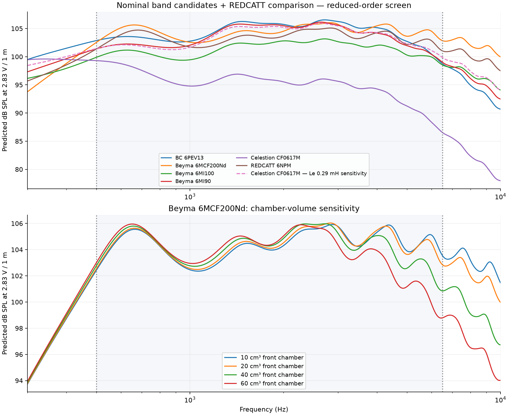
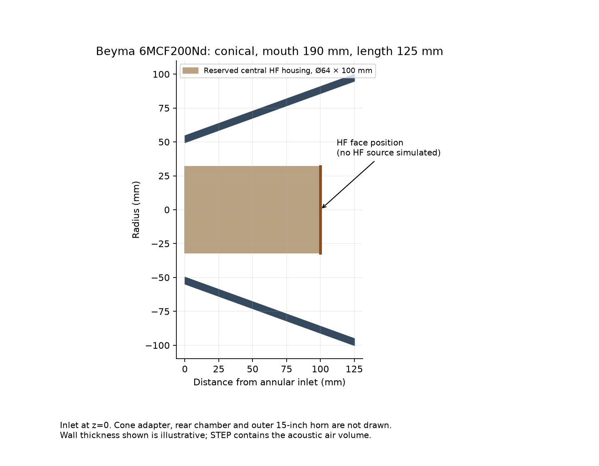

# 6.5-inch midrange search: 500 Hz–6.5 kHz

**Completed automated reduced-order screen. No physical crossover or complete coaxial system is validated.**

Screened **480 geometries × 26 verified 6.5-inch drivers**, plus one separately labelled Celestion inductance scenario: **12960 calculations**. The target remains exactly 500–6500 Hz.



## Results

All figures are unfiltered, on-axis, 2.83 V RMS at 1 m. These are model rankings, not sound-quality rankings. Each row uses its own best horn.

| Driver/scenario | Profile | Mouth / length (mm) | Equivalent / outer throat (mm) | Variation (dB) | Mean SPL (dB) | SPL at 6.5 kHz (dB) |
|---|---|---:|---:|---:|---:|---:|
| BC 6MDN44 | conical | 280 / 125 | 52 / 82.5 | 8.00 | 102.93 | 97.53 |
| BC 6PEV13 | conical | 280 / 125 | 47 / 79.4 | 7.78 | 104.24 | 98.76 |
| Beyma 6MCF200Nd | conical | 190 / 125 | 76 / 99.4 | 3.55 | 104.44 | 102.85 |
| Beyma 6MI100 | conical | 245 / 125 | 76 / 99.4 | 4.62 | 101.31 | 98.54 |
| Beyma 6MI90 | conical | 280 / 125 | 60 / 87.7 | 7.12 | 103.57 | 99.02 |
| Celestion CF0617M | conical | 280 / 125 | 42 / 76.6 | 12.75 | 95.13 | 86.55 |
| LaVoce MAF061.50 | conical | 280 / 125 | 76 / 99.4 | 6.14 | 103.38 | 99.44 |
| LaVoce MAN061.80 | exponential | 245 / 150 | 76 / 99.4 | 3.41 | 103.63 | 101.98 |
| PHL 1120 | conical | 280 / 125 | 52 / 82.5 | 7.67 | 101.96 | 96.65 |
| PHL 1120NdU | conical | 280 / 125 | 52 / 82.5 | 7.67 | 101.96 | 96.65 |
| PHL 1343 | exponential | 280 / 250 | 42 / 76.6 | 16.57 | 100.08 | 88.62 |
| PHL 1343NdU | exponential | 280 / 250 | 42 / 76.6 | 16.57 | 100.08 | 88.62 |
| PHL 1362 | exponential | 280 / 250 | 42 / 76.6 | 16.34 | 100.20 | 88.91 |
| PHL 1362NdU | exponential | 280 / 250 | 42 / 76.6 | 16.34 | 100.20 | 88.91 |
| PHL 1426 | conical | 280 / 125 | 47 / 79.4 | 8.57 | 100.85 | 94.64 |
| PHL 1426NdU | conical | 280 / 125 | 47 / 79.4 | 8.57 | 100.85 | 94.64 |
| PHL 1660NdM-SQ2 | conical | 280 / 125 | 42 / 76.6 | 9.90 | 102.55 | 94.74 |
| PHL 1660NdM | conical | 280 / 125 | 42 / 76.6 | 9.62 | 102.09 | 94.72 |
| PHL 1663 | conical | 280 / 125 | 47 / 79.4 | 8.76 | 102.93 | 96.54 |
| PHL 1680NdM-10 | conical | 280 / 125 | 47 / 79.4 | 10.19 | 100.86 | 93.27 |
| PHL 1683-26 | conical | 280 / 125 | 47 / 79.4 | 9.31 | 101.90 | 95.12 |
| PHL 1752 | conical | 280 / 125 | 42 / 76.6 | 9.54 | 102.50 | 95.26 |
| PHL 1752NdU | conical | 280 / 125 | 42 / 76.6 | 9.48 | 102.05 | 94.82 |
| REDCATT 61FHM-2 | conical | 280 / 125 | 42 / 76.6 | 11.47 | 91.06 | 82.11 |
| REDCATT 61FIND | conical | 280 / 125 | 68 / 93.4 | 6.71 | 95.47 | 90.94 |
| REDCATT 6NPM | conical | 190 / 125 | 76 / 99.4 | 4.05 | 103.41 | 101.04 |
| Celestion CF0617M — Le 0.29 mH sensitivity | conical | 280 / 125 | 68 / 93.4 | 6.09 | 103.47 | 99.87 |

**Selected nominal model: Beyma 6MCF200Nd**, conical, 190 mm mouth and 125 mm acoustic length. Open annular throat 45.36 cm², compression 3.09:1, radial gap 17.68 mm around the 64 mm housing.

The selected model meets the declared screen of ≤6 dB peak-to-peak variation and ≥100 dB mean output. Neither threshold establishes maximum output, distortion or physical suitability.

Drivers with unknown published bands or upper limits below 6.5 kHz remain exploratory comparisons and cannot win the nominal shortlist. The Celestion 0.29 mH scenario is a sensitivity case, not a sixth driver and not eligible for nominal selection.



[Selected acoustic-air STEP, mm](selected/acoustic-air-mm.step) · [Housing envelope STEP, mm](selected/housing-concept-mm.step) · [Celestion nominal geometry STEP, mm](celestion/acoustic-air-mm.step) · [Full search CSV](search.csv) · [Driver inputs](drivers.json) · [Machine-readable study](study.json)

## Search and selection

Four profiles: conical, exponential, hyperbolic and OS. Equivalent throat diameters: 42, 47, 52, 60, 68 and 76 mm. Mouth diameters: 190, 210, 245 and 280 mm. Acoustic lengths: 125, 150, 200, 250 and 300 mm. Every geometry retains a 64 mm diameter × 100 mm central body. Outer throat diameter is sqrt(equivalent² + 64²), never a circular hole smaller than the tweeter.

Nominal front volume is 20 cm³ and external sealed rear volume 2 litres for open-basket drivers. Factory-sealed Beyma 6MCF200Nd and PHL 1660NdM-SQ2 use their published combined driver/rear-load parameters with no additional rear chamber. Neither is a demonstrated cone adapter or packaged rear chamber. Selection first requires nominal manufacturer band coverage and excludes sensitivity scenarios; among those it prefers mean SPL ≥100 dB, then minimum unfiltered peak-to-peak variation. If none meet the mean level, it selects minimum variation and reports the miss. All 480 geometries are evaluated at 300 sections and 603 frequency points, including exact band endpoints; winners are re-evaluated at 600 sections. Finite grid only, no global optimum claimed.

## Celestion uncertainty

Celestion currently publishes Le=1.73 mH. The 2015 Voice Coil test reports about 0.28–0.30 mH in its inductance-versus-displacement analysis. These values have different measurement contexts and cannot be treated as interchangeable measured broadband impedances. Both are run with an explicitly simplified constant-Le model; 0.29 mH is an uncertainty probe, never a silent correction.

With the nominal value the best Celestion geometry has 12.75 dB variation and 86.55 dB at 6.5 kHz. See the separate sensitivity row before interpreting its relative ranking. Celestion's current 2.7 mm Xmax definition includes a gap allowance; geometric coil overhang is 1.2 mm. No maximum-SPL claim is made.

## Robustness and model limits

Front chambers of 10/20/40/60 cm³ and rear volumes of 0.5/1/2/4 L were checked for each winning scenario. Factory-sealed drivers ignore the external rear-volume sweep; their identical rows are intentional. Full values are in study.json. Selection uses the declared nominal volumes; sensitivity results are not folded into a hidden score. Numerical section/frequency convergence and real-power conservation passed for every reported scenario. STEP export/re-import checks confirm connected air volumes at millimetre scale.

For context, this reduced-order model predicts 4.79 dB more output at 6.5 kHz than preserved modal FEM for the original unobstructed 6NMB420 horn with matched assumptions. This is evidence of upper-band model uncertainty, not a correction factor for these new horns.

- Plane-wave, lossless acoustic network with a rigid-piston motor and constant inductance. No measured cone breakup, phase-equalising channels, viscothermal losses or nonlinear distortion.
- Central HF housing is a rigid obstruction. HF output, loading, time alignment and crossover summation are absent. A T90A-shaped envelope is retained for clearance only: the T90A itself is specified for ≥7 kHz and is not qualified for this 6.5 kHz target.
- The existing production modal FEM gate rejects annular inlet ports; Docker is unavailable. This run is not production FEM.
- The 15-inch outer horn is unspecified and not simulated. Driver frame diameters, rear chambers, mounting walls and support struts must be included before claiming that the mid assembly fits or preserves the outer horn response.
- The selected STEP starts at the annular inlet and excludes the real cone-following adapter, retention, cable route and supports. A suitable prototype phase plug still needs the actual cone/dustcap contour.
- Driver sensitivity and power ratings are not maximum system output. Manufacturer nominal upper ranges do not validate 6.5 kHz horn operation.

## Reproduce

From the repository root, with the same Python 3.12 environment as the earlier annular study:

```sh
.venv-t90a/bin/python scripts/study_6p5_mid.py --output results/6p5-mid-500-6500
.venv-t90a/bin/python -m pytest scripts/tests/test_t90a_annular.py scripts/tests/test_6p5_mid.py -q
```

[Dependency versions](requirements.txt). The manifest hashes executed repository sources, driver inputs and all output files. The source Git revision is supplementary; file hashes include working-tree changes.

## Manufacturer sources

- [BC 6MDN44](https://www.bcspeakers.com/en/products/lf-driver/6.5/8/6MDN44): verified 6.5-inch nominal size; basket envelope 187 × 73 mm.
- [BC 6PEV13](https://old.bcspeakers.com/en/products/lf-driver/6-5/8/6pev13.pdf): verified 6.5-inch nominal size; basket envelope 187 × 78 mm.
- [Beyma 6MCF200Nd](https://www.beyma.com/speakers/Fichas_Tecnicas/beyma-speakers-data-sheet-low-mid-frequency-6MCF200Nd.pdf): verified 6.5-inch nominal size; basket envelope 174 × 75 mm.
- [Beyma 6MI100](https://www.beyma.com/en/products/c/low-mid-frequency/106MI108/loudspeaker-6mi100-8-oh/): verified 6.5-inch nominal size; basket envelope 174 × 85 mm.
- [Beyma 6MI90](https://www.beyma.com/speakers/Fichas_Tecnicas/beyma-speakers-data-sheet-low-mid-frequency-6MI90.pdf): verified 6.5-inch nominal size; basket envelope 174 × 84 mm.
- [Celestion CF0617M](https://celestion.com/product/cf0617m/): verified 6.5-inch nominal size; basket envelope 189 × 78.5 mm.
- [LaVoce MAF061.50](https://lavocespeakers.com/product/maf061-50/): verified 6.5-inch nominal size; basket envelope 170 × 82 mm.
- [LaVoce MAN061.80](https://lavocespeakers.com/product/man061-80/): verified 6.5-inch nominal size; basket envelope None × None mm.
- [PHL 1120](https://phlaudio.com/fileadmin/user_upload/phl_audio/1120_SpecSheet.pdf): verified 6.5-inch nominal size; basket envelope 187.5 × 68.5 mm.
- [PHL 1120NdU](https://phlaudio.com/fileadmin/user_upload/phl_audio/1120NdU_SpecSheet.pdf): verified 6.5-inch nominal size; basket envelope 187.5 × 74.0 mm.
- [PHL 1343](https://phlaudio.com/fileadmin/user_upload/phl_audio/1343_SpecSheet.pdf): verified 6.5-inch nominal size; basket envelope 187.5 × 72.5 mm.
- [PHL 1343NdU](https://phlaudio.com/fileadmin/user_upload/phl_audio/1343NdU_SpecSheet.pdf): verified 6.5-inch nominal size; basket envelope 187.5 × 74.0 mm.
- [PHL 1362](https://phlaudio.com/fileadmin/user_upload/phl_audio/1362_SpecSheet.pdf): verified 6.5-inch nominal size; basket envelope 187.5 × 72.5 mm.
- [PHL 1362NdU](https://phlaudio.com/fileadmin/user_upload/phl_audio/1362NdU_SpecSheet.pdf): verified 6.5-inch nominal size; basket envelope 187.5 × 74.0 mm.
- [PHL 1426](https://phlaudio.com/fileadmin/user_upload/phl_audio/1426_SpecSheet.pdf): verified 6.5-inch nominal size; basket envelope 187.5 × 68.5 mm.
- [PHL 1426NdU](https://phlaudio.com/fileadmin/user_upload/phl_audio/1426NdU_SpecSheet.pdf): verified 6.5-inch nominal size; basket envelope 187.5 × 74.0 mm.
- [PHL 1660NdM-SQ2](https://phlaudio.com/fileadmin/user_upload/phl_audio/1660NdM-SQ2_SpecSheet.pdf): verified 6.5-inch nominal size; basket envelope 187.5 × 63.0 mm.
- [PHL 1660NdM](https://phlaudio.com/fileadmin/user_upload/phl_audio/1660NdM_SpecSheet.pdf): verified 6.5-inch nominal size; basket envelope 187.5 × 63.0 mm.
- [PHL 1663](https://phlaudio.com/fileadmin/user_upload/phl_audio/1663_SpecSheet.pdf): verified 6.5-inch nominal size; basket envelope 187.5 × 73.5 mm.
- [PHL 1680NdM-10](https://phlaudio.com/fileadmin/user_upload/phl_audio/1680NdM-10_SpecSheet.pdf): verified 6.5-inch nominal size; basket envelope 187.5 × 63.0 mm.
- [PHL 1683-26](https://phlaudio.com/fileadmin/user_upload/phl_audio/1683-26_SpecSheet.pdf): verified 6.5-inch nominal size; basket envelope 187.5 × 73.5 mm.
- [PHL 1752](https://phlaudio.com/fileadmin/user_upload/phl_audio/1752_SpecSheet.pdf): verified 6.5-inch nominal size; basket envelope 187.5 × 73.5 mm.
- [PHL 1752NdU](https://phlaudio.com/fileadmin/user_upload/phl_audio/1752NdU_SpecSheet.pdf): verified 6.5-inch nominal size; basket envelope 187.5 × 76.5 mm.
- [REDCATT 61FHM-2](https://www.redcatt.net/products/dr-65-001-4r-b2-c0001): verified 6.5-inch nominal size; basket envelope 165.5 × 68 mm.
- [REDCATT 61FIND](https://www.redcatt.net/products/dr-65-002-16r-b2-c0001): verified 6.5-inch nominal size; basket envelope 165.2 × 78 mm.
- [REDCATT 6NPM](https://www.redcatt.net/products/dr-65-006-8r-b2-c0001): verified 6.5-inch nominal size; basket envelope None × 52.5 mm.
- [Celestion independent measurements and alternative inductance context](https://audioxpress.com/article/test-bench-celestion-cf0617m-prosound-midrange-driver)
